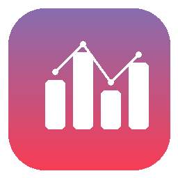
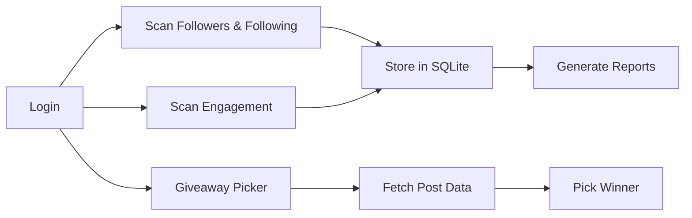

<p align="center">
  
</p>

<h1 align="center">Instagram Analytics</h1>

<p align="center">
  A desktop app to track your Instagram followers, engagement, content performance, and run giveaway winner picks — all stored locally.
</p>

<p align="center">
  
  
  
  
</p>

---

## Features

### 📊 Dashboard & Follower Tracking
- **Follower / Following counts** with change deltas between scans
- **Don't Follow Back** — people you follow who don't follow you
- **Fans** — people who follow you but you don't follow back
- **Unfollowers** — detect who unfollowed since last scan
- **New Followers** — see who recently followed you
- **Timeline** — historical follower/following graph across all scans
- **Auto-load last report** — selecting a saved account instantly shows the most recent scan data

### 🌊 Engagement & Content Analytics
- **Content breakdown** by type (Photo, Reel, Carousel, Video, IGTV) with avg likes, comments, views, and engagement rate
- **Top posts table** — sortable by engagement rate with clickable links
- **Best day & best hour** to post based on historical performance
- **Engagement trend** — compares older vs newer posts
- **Active followers** ranked by interaction count
- **Ghost followers** — followers with zero engagement on your recent posts
- **Loyal followers** — users who like, comment, AND view your stories
- **Story viewers** list with follower status

### 🏆 Giveaway Winner Picker
- Paste any public Instagram post/reel URL
- Fetches **likers**, **commenters**, and **author's followers**
- Filter by intersection (e.g. users who liked AND commented AND follow)
- **Reproducible picks** with optional seed value
- Animated winner reveal with confetti

### ⚡ Actions
- **Batch unfollow** users directly from Don't Follow Back, Unfollowers, or Ghost tables
- **Open profiles** in browser (single or batch)
- **Copy post links** to clipboard from the top posts table
- **Cancel button** — stop any long-running operation mid-way

### 🎨 UI
- **Dark & Light themes** — toggle with one click
- **Color-coded tabs** — purple for follower tabs, teal for engagement tabs
- **Profile photos** — circular thumbnails cached locally
- **Tooltips** on every metric explaining what it means
- **Real-time progress** bar and log during operations
- **Clear log** button to reset the activity log
- **Sort & filter** on all tables — click any column header to sort, use the filter bar to search
- **Per-step timing** in logs so you know how long each stage takes

### 🛡️ Anti-Detection & Session Management
- **Session reuse** — detects active sessions automatically; login button shows status ("⏳ Checking..." → "✅ Already logged in")
- **Background keep-alive** — pings Instagram every 5–12 minutes to keep your session warm
- **Human-like delays** — randomized pauses between API calls (3–8s per request, 10–20s pauses every 5 posts)
- **Engagement frequency warning** — warns if you run engagement analysis more than once in 24 hours
- **Per-account data isolation** — each account gets its own session file, database, and photo cache

---

## Privacy & Security

> **Your credentials never leave your machine.**

All usernames and passwords are stored **locally on your device only** — in `UserData/saved_accounts.json` (base64-encoded). They are **never uploaded, transmitted, or shared** with any server other than Instagram's own API during login.

If you prefer not to save your password locally, simply leave the **"Save"** checkbox unchecked. You can enter your password manually each time you need to log in — the app works exactly the same either way.

---

## Quick Start

### 1. Install dependencies

```bash
pip install -r requirements.txt
```

### 2. Run the app

```bash
python main.py
```

### 3. Log in & scan

Enter your Instagram username and password, then click **🔑 Login** or **▶ Scan Followers & Following**.

> **First-time users:** A disclaimer will appear about using the unofficial Instagram API. You must accept to continue.

---

## Tabs

| Tab | What it shows |
|-----|---------------|
| **📊 Summary** | Follower/following counts, mutuals, fans, NFB, growth metrics |
| **💜 Don't Follow Back** | Users you follow who don't follow back — with unfollow/browser actions |
| **💜 Fans** | Users who follow you but you don't follow back |
| **💜 Unfollowers** | Users who unfollowed since last scan |
| **💜 New Followers** | Users who started following since last scan |
| **🌊 Content** | Per-post metrics, content type breakdown, top posts |
| **🌊 Engagement** | Active followers, non-follower engagers, loyal followers, story viewers |
| **🌊 Ghosts** | Ghost followers with unfollow actions |
| **🕔 Timeline** | Historical follower/following counts |
| **🏆 Winner** | Giveaway picker from any post URL |
| **📝 Log** | Real-time activity log with clear button |

---

## Project Structure

```
Instagram_Analytics/
├── main.py           # GUI application (Tkinter)
├── scraper.py        # Instagram API layer (instagrapi)
├── analytics.py      # Analytics & report computation
├── db.py             # SQLite storage layer
├── requirements.txt  # Python dependencies
├── app_icon.png      # App icon
└── UserData/         # Local data (gitignored)
    ├── saved_accounts.json
    └── {username}/
        ├── ig_session.json
        ├── data/
        │   └── {username}.db
        └── profile_photos/
```

---

## How It Works



1. **Login** — Authenticates via instagrapi with session reuse and 2FA support. Active sessions are detected automatically so you don't re-login unnecessarily.
2. **Scan** — Fetches follower/following lists and stores snapshots in per-profile SQLite databases. Reuses existing sessions when available.
3. **Analyze** — Compares current vs previous scans to detect unfollowers, new followers, and growth trends. Last report auto-loads when you select an account.
4. **Engagement** — Fetches recent posts (default: 10) and ranks followers by interaction frequency. Includes anti-detection delays.
5. **Giveaway** — Scrapes a post's likers/commenters, intersects with filters, and picks a random winner.

---

## Rate Limiting & Anti-Detection

The app handles Instagram's rate limits and minimizes detection risk:
- Detects throttle errors and shows countdown timers on buttons
- Returns partial data if rate-limited mid-operation
- Adds randomized delays between API requests (3–7s base, extra pauses every 5 posts)
- Background session keep-alive mimics normal app usage
- Warns before running engagement analysis too frequently

---

## ⚠️ Disclaimer

This application uses [instagrapi](https://github.com/subzeroid/instagrapi), an **unofficial** third-party library that interacts with Instagram's private API.

- Using unofficial API clients **violates Instagram's Terms of Service** and may result in temporary or permanent account restrictions, including bans.
- This tool is provided for **educational and personal use only**.
- The developer assumes **no responsibility** for any consequences to your account.
- **Use entirely at your own risk.**

---

## License

MIT
